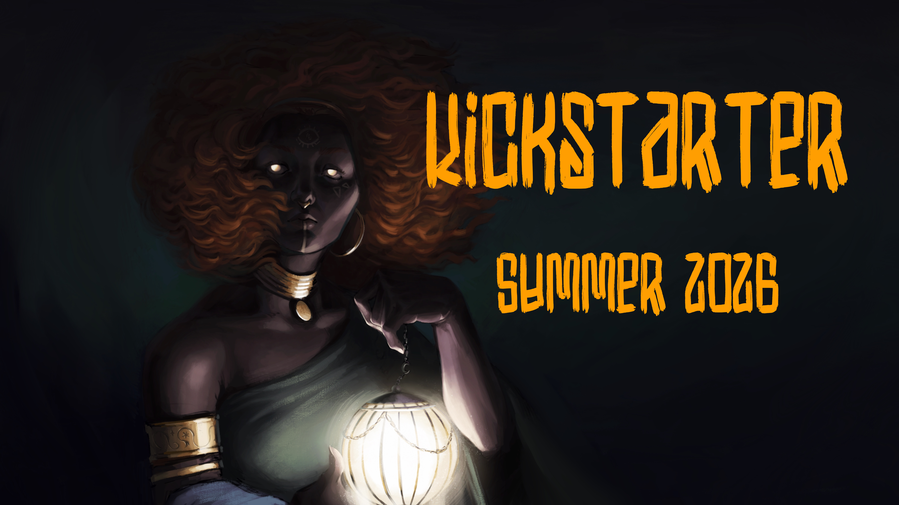

# Under Shadow of Night
> Mythical Stone Age Horror

Is a tabletop roleplaying game where the players dive into a forgotten time of mythical creatures beyond gods and monsters in the world of [Velherak][1]. Players take on the mantle of Wardens, and together with they must defend the people against mythical horrors, changing landscapes and terrible calamities that befall the region.

 It is played by between two and seven players, where one player takes the role of Storyteller and the others become the Wardens.

> **Under Shadow of Night** is currently in early access and will be developed with the input of the community. Please feel free to join our discord and the journey of this Stone Age Horror roleplaying game.

---- 
<i>Kickstarter for a printed rulebook coming soon...<i>

[1]:	https://eriard.github.io/VelherakWeb/Setting.html